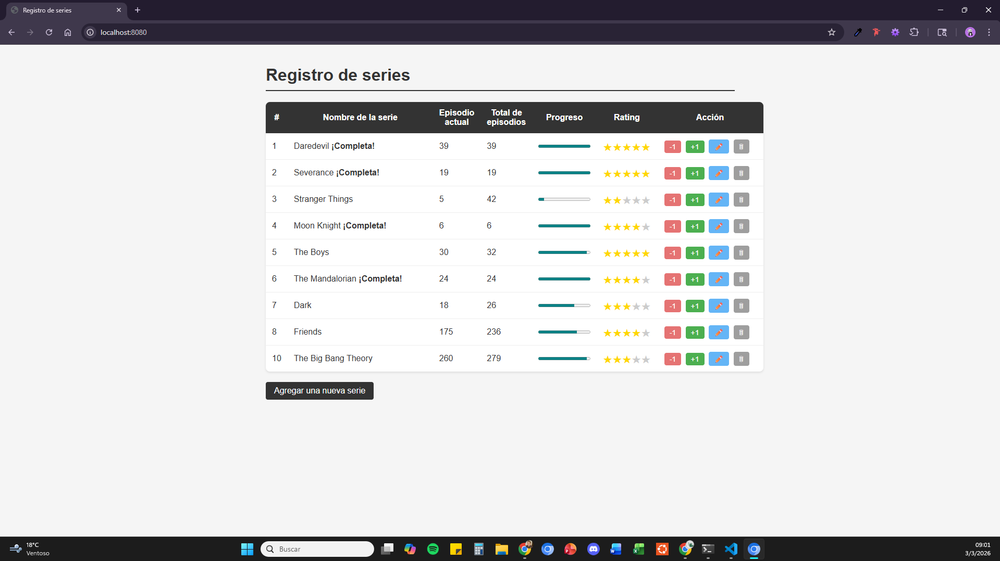

# **Registro de series**
Sistemas y tecnologías web - S40
> Marco Carbajal (23025)

## Retos implementados

- Estilos y CSS (archivos estáticos)
- Código JavaScript ordenado en archivos
- Barra de progreso (episodios vistos vs total)
- Marcar serie como completa con texto especial
- Botón -1
- Eliminar serie (método DELETE)
- Editar serie (método PUT)
- Sistema de rating de 5 estrellas (tabla propia en SQLite)

## Estructura del proyecto

```
proyecto/
├── main.go
├── series.db
├── images/
│   └── screenshot.png
└── static/
    ├── styles.css
    └── script.js
```

## Vista previa

